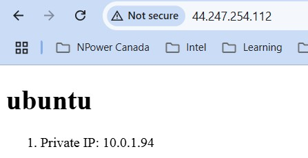

# 4640-w11-lab-start-w25

See lab instructions on D2L

Follow the steps below to set up infrastructure and configure your servers:

---

## Run Terraform to Create Infrastructure

Navigate to the `terraform` directory, initialize Terraform, and apply the configuration:

```bash
cd terraform  
terraform init  
terraform apply
```

You may need to confirm the changes by typing `yes` during execution.

---

## Run Ansible Playbook

After the infrastructure is provisioned, navigate to the `ansible` directory and execute the playbook to configure the servers:

```bash
cd ../ansible  
ansible-playbook playbook.yml
```

This playbook will complete tasks for both the frontend and Redis servers.

---

## Verify the Setup

1. **Frontend Server:**
   - Open a web browser and navigate to the public IP address of the Ubuntu server
   - You should see the HTML file served by Nginx, confirming that the frontend is set up correctly.

2. **Redis Server:**
   - Log in to the Rocky Linux server and confirm Redis is running:

     ```bash
     systemctl status redis
     ```

---

## Notes

Make sure all dependencies (e.g., SSH keys and required Ansible plugins) are configured correctly before running the playbook


